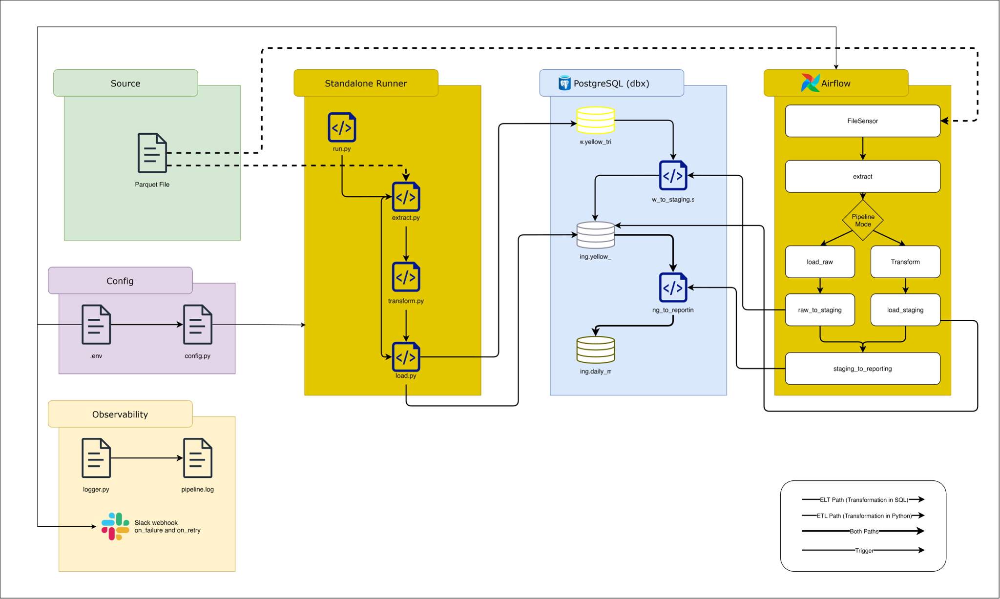

# NYC Taxi ELT/ETL Pipeline

An end-to-end ELT/ETL pipeline processing NYC yellow taxi trip records through a three-layer PostgreSQL schema (raw → staging → reporting). Supports both Python-based transformation (ETL) and database-native transformation (ELT) via a CLI flag. Optionally orchestrated with Apache Airflow for monthly scheduled runs.

Built as part of a 9-month data engineering curriculum.

---

## Problem Statement
The NYC Taxi and Limousine Commission publishes [monthly trip records](https://www.nyc.gov/site/tlc/about/tlc-trip-record-data.page) in parquet format. Raw data contains invalid records, such as zero-fare trips, zero-distance trips, negative durations, and timestamp errors (potentially from DST boundary crossing). This pipeline extracts the raw file, enforces documented quality rules, and loads only valid records into a structured PostgreSQL schema for downstream analysis.

---

## Architecture
Architecture Diagram:


Current PSQL Schema:


| Layer | Table | Purpose |
|---|---|---|
| `raw` | `raw.yellow_trips` | Landing zone: all 20 source columns stored as TEXT, no cleaning |
| `staging` | `staging.yellow_trips` | Typed, constrained, cleaned, and business rules applied |
| `reporting` | `reporting.daily_metrics` | Aggregated daily metrics for downstream analysis |


---

### Two Pipeline Paths
 
The pipeline supports two execution paths selected via CLI flag.
 
**ELT Path (default) — transformation happens inside PostgreSQL**
 
```
yellow_tripdata_YYYY-MM.parquet
        │
        ▼
    extract()                ← schema validation against all 20 source columns
        │
        ▼
    load()                   ← batch insert to raw.yellow_trips (all TEXT)
        │
        ▼
    raw_to_staging.sql       ← column selection, type casting, null handling,
        │                      business rules, timeframe filter, duration derivation (inside PSQL)
        ▼
    staging_to_reporting.sql ← daily aggregation with ON CONFLICT DO UPDATE SET
```
 
**ETL Path — transformation happens in Python**
 
```
yellow_tripdata_YYYY-MM.parquet
        │
        ▼
    extract()                ← schema validation against all 20 source columns
        │
        ▼
    transform()              ← column selection, null handling, business rules,
        │                      type casting, timeframe filter, duration derivation (pandas)
        ▼
    validate_dataframe()     ← Great Expectations suite (6 expectations)
        │
        ▼
    load()                   ← batch insert to staging.yellow_trips
        │
        ▼
    staging_to_reporting.sql ← daily aggregation with ON CONFLICT DO UPDATE SET
```

---

## Tech Stack
| Tool | Purpose |
|---|---|
| Python | Pipeline language |
| pandas | Extraction and transformation |
| psycopg2 | PostgreSQL connection and batch insert |
| pyarrow | Parquet file reading |
| python-dotenv | Environment variable management |
| Great Expectations | Data quality validation (ETL path) |
| pytest | Unit and integration test suite |
| PostgreSQL | Destination database |
| Docker | Containerization |
| Apache Airflow | Monthly DAG orchestration, ELT/ETL branching, Slack alerts |
| Redis | Celery broker for Airflow CeleryExecutor |

---

## Project Structure
```
nyc_taxi_etl/
├── src/
│   ├── config.py           # Environment variable loader with validation
│   ├── exceptions.py       # Custom exceptions per pipeline stage
│   ├── extract.py          # Parquet reading and schema validation
│   ├── transform.py        # Cleaning, casting, timeframe filtering, and derivation (ETL path)
│   ├── load.py             # Batch insert, SQL execution, connection management
│   ├── validate.py         # Great Expectations suite
│   └── logger.py           # Dual-handler logger (console + file); skips setup when running under Airflow
├── sql/
│   ├── 01_create_tables.sql        # Three-layer schema DDL for production
│   ├── 02_create_test_db.sql       # Three-layer schema DDL for testing
│   ├── raw_to_staging.sql          # ELT transformation inside PostgreSQL
│   └── staging_to_reporting.sql    # Daily aggregation with upsert guard
├── tests/
│   ├── conftest.py         # Shared fixtures and test DB config
│   ├── test_extract.py     # Extract stage tests
│   ├── test_transform.py   # Transform stage tests
│   └── test_load.py        # Load stage integration tests
├── airflow/
│   ├── dags/
│   │   ├── nyc_taxi_elt.py # Monthly DAG with ELT/ETL branching and Slack failure alerts
│   │   └── ping_slack.py   # Slack webhook connectivity test DAG
│   ├── docker-compose.yaml # Airflow stack (scheduler, worker, API server, Redis, PostgreSQL metastore)
│   └── .env.example        # Airflow environment variable template
├── data/                   # Source parquet files — gitignored
├── docs/                   # Architecture diagrams for README
├── logs/                   # Pipeline logs — gitignored, created at runtime
├── .env.example            # Required environment variables
├── requirements.txt        # Python dependencies
├── .dockerignore           # Files excluded from Docker build
├── docker-compose.yml      # ETL stack (PostgreSQL + ETL service)
├── Dockerfile              # Python 3.13-slim image
├── log_parser.py           # Parse summary from pipeline.log
├── Makefile                # Standardized workflow commands
└── run.py                  # Entry point with argparse
```

---

## Setup
### OPTION 1 - Docker (RECOMMENDED)
Requires Docker Desktop installed and running.

### 1. Clone the repo and navigate to the project folder
```bash
git clone https://github.com/Davidngann/de-portfolio.git
cd de-portfolio/projects/nyc_taxi_etl
```

### 2. Place your source parquet file in `data/` and edit `.env`
Download Yellow Taxi trip records (Parquet format) from the [TLC Trip Record Data page](https://www.nyc.gov/site/tlc/about/tlc-trip-record-data.page) and place the file in the `data/` folder.
Then, copy and edit the environment variables:

```bash
cp .env.example .env # Edit .env with your preferred PostgreSQL credentials and source filename
```

### 3. Spin up the dbx (PostgreSQL) service
```bash
make docker-up
```

### 4. Run the pipeline

```bash
make run
```
Runs the ELT pipeline. Logs are written to `logs/pipeline.log`.

To run the ETL path instead:
```bash
make run-staging
```

To bring down and remove all docker containers and volumes:
```bash
make docker-wipe
```

Visit the image on Docker Hub: [Docker Hub image](https://hub.docker.com/r/davidngan/nyc-taxi-etl)

**NOTE**
By default, docker-compose will build the etl image locally.  
To pull from Docker Hub instead, swap the comment in `docker-compose.yml`:

```yaml
# Comment this out:
# build: .

# Uncomment this:
image: davidngan/nyc-taxi-etl:latest
```
---
To run the CI workflow:
```bash
make docker-wipe # Bring everything down
make build       # Ensure clean build
make docker-up   # Bring dbx service up
make ci          # Run CI workflow and tear down all services and volumes
```

---
### OPTION 2 - Local Setup (MANUAL)
Requires PostgreSQL installed and running.

#### 1. Clone the repo
 
```bash
git clone https://github.com/Davidngann/de-portfolio.git
cd de-portfolio/projects/nyc_taxi_etl
```
 
#### 2. Create virtual environment
 
```bash
python -m venv .venv
.\.venv\Scripts\activate     # Windows
source .venv/bin/activate    # Mac/Linux
```
 
#### 3. Install dependencies
 
```bash
make install
```
 
#### 4. Configure environment
 
```bash
cp .env.example .env
# Edit .env with your PostgreSQL credentials and source filename
```
 
#### 5. Download source data
 
Download Yellow Taxi trip records (Parquet format) from the [TLC Trip Record Data page](https://www.nyc.gov/site/tlc/about/tlc-trip-record-data.page) and place the file in the `data/` folder.
 
#### 6. Create the destination schemas
 
```bash
# Create taxi_db (production) database, then run:
psql -U postgres -c "CREATE DATABASE taxi_db"
psql -U {username} -d taxi_db -f sql/01_create_tables.sql
psql -U {username} -f sql/02_create_test_db.sql  # Creates taxi_db_test for the test suite
```
 
#### 7. Run the pipeline
 
```bash
# ELT path (default) — loads raw data to PostgreSQL, transforms via SQL
python run.py --target-schema raw
 
# ETL path — transforms via Python, loads directly to staging
python run.py --target-schema staging
```

---

### OPTION 3 - Airflow Orchestration (OPTIONAL)
Runs the pipeline as a monthly scheduled DAG with ELT/ETL branching, a FileSensor wait, and Slack failure alerts.  
Requires Docker Desktop and the ETL stack (OPTION 1) already running.

#### 1. Configure the Airflow environment

```bash
cp airflow/.env.example airflow/.env
# Edit airflow/.env with Airflow credentials, Slack webhook URL, and DB connection details
```

#### 2. Start the Airflow stack

```bash
make airflow-up
```

Access the Airflow UI at `http://localhost:8080`.

#### 3. Wire Airflow connections

In the Airflow UI (Admin → Connections), create:

| Conn ID | Type | Details |
|---|---|---|
| `nyc_taxi_pg` | Postgres | Host: `host.docker.internal`, Port: `5433`, Schema: `taxi_db` |
| `slack_webhook` | HTTP | Host: your Slack incoming webhook URL |

Alternatively, set these as environment variables in `airflow/.env` — the stack reads them on startup via the Airflow connections env var format.

#### 4. Configure Airflow Variables

In the Airflow UI (Admin → Variables), set:

| Key | Example value | Notes |
|---|---|---|
| `PIPELINE_MODE` | `elt` | `elt` routes to ELT path; `etl` routes to ETL path |
| `BATCH_SIZE` | `5000` | Rows per insert batch |

`SOURCE_FILE` is derived automatically from the DAG's `logical_date` (e.g., a run with `logical_date=2026-02-01` processes `yellow_tripdata_2026-02.parquet`). No manual variable needed.

#### 5. Trigger a run

Trigger the `nyc_taxi_elt` DAG manually from the UI, backfill, or wait for the monthly schedule (`@monthly`, starting 2026-02-01).

#### DAG structure

```
FileSensor (wait for source parquet)
        │
        ▼
    extract
        │
        ▼
    branch (PIPELINE_MODE variable)
       ┌──────────────────────┐
       ▼                      ▼
   [ELT path]            [ETL path]
   load_raw              transform
       │                      │
       ▼                      ▼
   raw_to_staging         load_staging
       │                      │
       └──────────┬───────────┘
                  ▼
         staging_to_reporting
```

On any task failure, a Slack message is sent with the task name, exception, and log URL.
Example:


#### Tear down the Airflow stack

```bash
make airflow-down  # Stop containers, keep volumes
make airflow-wipe  # Stop containers and delete volumes
```

---

## Available Make Commands
| Command | Description |
|---|---|
| `make install` | Install dependencies from requirements.txt locally |
| `make build` | Build the etl container image |
| `make run` | Run the ELT pipeline (loads to raw) |
| `make run-staging` | Run the ETL pipeline (transforms in Python, loads to staging) |
| `make test` | Run the full test suite in Docker |
| `make clean` | Remove Python cache files |
| `make docker-up` | Start the database container (dbx) |
| `make docker-down` | Stop containers, keep volume |
| `make docker-wipe` | Stop containers and delete volume |
| `make logs` | Tail dbx container logs |
| `make live-logs` | Tail containers in real time while pipeline is running |
| `make parse-logs` | Print log summary with error count from pipeline.log |
| `make ci` | Build image, start stack, run tests, tear down. Leaves stack running on test failure |
| `make ci-local` | Build image, start stack, run tests, and tear down even if tests fail |
| `make airflow-up` | Start the full Airflow stack (scheduler, worker, API, Redis, PostgreSQL metastore) |
| `make airflow-down` | Stop Airflow containers, keep volumes |
| `make airflow-wipe` | Stop Airflow containers and delete volumes |


---

## Data Quality Rules
### Column selection (10 of 20 used in staging)
 
| Column | Kept | Reason |
|---|---|---|
| `tpep_pickup_datetime` | ✓ | Required for duration derivation and timeframe validation |
| `tpep_dropoff_datetime` | ✓ | Required for duration derivation |
| `passenger_count` | ✓ | Operational metric |
| `trip_distance` | ✓ | Core business metric |
| `PULocationID` | ✓ | Required for zone analysis |
| `DOLocationID` | ✓ | Required for zone analysis |
| `fare_amount` | ✓ | Core financial metric |
| `tip_amount` | ✓ | Financial metric |
| `total_amount` | ✓ | Core financial metric |
| `payment_type` | ✓ | Operational metric |

The remaining 10 columns are preserved in `raw.yellow_trips` for auditability.


### Null handling
| Column | Rule | Reason |
|---|---|---|
| `pickup_at`, `dropoff_at` | DROP | Duration cannot be derived without both |
| `trip_distance` | DROP | Core business metric |
| `fare_amount` | DROP | Core business metric |
| `total_amount` | DROP | Core business metric |
| `pickup_zone_id` | DROP | NOT NULL in destination schema |
| `dropoff_zone_id` | DROP | NOT NULL in destination schema |
| `passenger_count` | KEEP | Self-reported, often missing, still usable |
| `tip_amount` | KEEP | Missing tip treated as $0 |
| `payment_type` | KEEP | Row is usable without payment method |


### Business rule filters
| Rule | Reason |
|---|---|
| `trip_distance > 0` | Zero-distance trips are not real trips |
| `fare_amount > 0` | Zero-fare trips are not valid records |
| `total_amount > 0` | Zero-total trips are not valid records |
| `trip_duration_minutes > 0` | Negative or zero duration indicates a timestamp error |
| `trip_duration_minutes ≤ 1440` | Trips over 24 hours treated as corrupt data |

### Timeframe filter
TLC parquet files include a small number of trips whose pickup timestamps fall outside the nominal month (e.g., straggler records from the previous or next month). The pipeline retains trips within a ±1 day window around the source month boundaries and drops any records outside that window.

| Rule | Reason |
|---|---|
| `pickup_at ≥ first_day_of_month − 1 day` | Allows boundary stragglers from the prior month |
| `pickup_at ≤ last_day_of_month + 1 day` | Allows boundary stragglers from the next month |

Applied in `transform.py` (ETL path) and in `raw_to_staging.sql` (ELT path).

---
## Sample Results
 
Dataset: `yellow_tripdata_2025-04.parquet`
 
**ELT Path**
 
| Stage | Rows |
|---|---|
| Extracted → `raw.yellow_trips` | 3,970,553 |
| `raw_to_staging.sql` → `staging.yellow_trips` | 3,672,139 |
| `staging_to_reporting.sql` → `reporting.daily_metrics` | 32 |
 
Load time: ~15 min 58 sec · Batch size: 5,000 · Total batches: 795

<details>
<summary> ELT log result snippet </summary>

```
2026-03-28 17:03:38,295 | INFO | __main__ | Pipeline starting | ENV: DEVELOPMENT | Target Schema: raw
2026-03-28 17:03:38,296 | INFO | src.extract | Starting extraction from <location>\de-portfolio\projects\nyc_taxi_etl\data\yellow_tripdata_2025-04.parquet
2026-03-28 17:03:40,908 | INFO | src.extract | Raw file loaded: 3,970,553, rows, 20 columns
2026-03-28 17:03:40,911 | INFO | src.extract | Schema validation passed
2026-03-28 17:03:40,911 | INFO | src.extract | Extraction complete: 3,970,553 rows returned
2026-03-28 17:06:03,132 | INFO | src.load | [raw] starting load: 3,970,553 rows | Batch size: 5,000 | Total batches: 795
2026-03-28 17:06:04,595 | INFO | src.load | Batch for raw: 1/795 | Rows loaded: 5,000/3,970,553
2026-03-28 17:06:05,517 | INFO | src.load | Batch for raw: 2/795 | Rows loaded: 10,000/3,970,553
...
...
2026-03-28 17:18:57,730 | INFO | src.load | Load complete | 3,970,553 rows inserted across 795 batches
2026-03-28 17:18:57,731 | INFO | src.load | Database connection closed
2026-03-28 17:19:00,529 | INFO | src.load | Starting SQL script: sql/raw_to_staging.sql
2026-03-28 17:21:51,186 | INFO | src.load | SQL script executed: sql/raw_to_staging.sql | PSQL Status: INSERT 0 3672139 | Rows affected: 3,672,139
2026-03-28 17:21:51,186 | INFO | src.load | Successfully executed sql script: sql/raw_to_staging.sql
2026-03-28 17:21:51,190 | INFO | src.load | Database connection closed
2026-03-28 17:21:51,305 | INFO | src.load | Starting SQL script: sql/staging_to_reporting.sql
2026-03-28 17:22:01,291 | INFO | src.load | SQL script executed: sql/staging_to_reporting.sql | PSQL Status: INSERT 0 32 | Rows affected: 32
2026-03-28 17:22:01,292 | INFO | src.load | Successfully executed sql script: sql/staging_to_reporting.sql
2026-03-28 17:22:01,294 | INFO | src.load | Database connection closed
2026-03-28 17:22:01,295 | INFO | __main__ | Pipeline complete
```

</details>

---

**ETL Path**
 
| Stage | Rows |
|---|---|
| Extracted | 3,970,553 |
| After null handling | 3,970,553 |
| After business rule filters | 3,706,063 |
| After duration filters | 3,672,139 |
| Loaded → `staging.yellow_trips` | 3,672,139 |
| Aggregated → `reporting.daily_metrics` | 32 |
| Total dropped | 298,414 (7.5%) |
 
Load time: ~7 min 46 sec · Batch size: 5,000 · Total batches: 735

<details>
<summary> ETL log result snippet </summary>

```
2026-03-28 17:26:00,233 | INFO | __main__ | Pipeline starting | ENV: DEVELOPMENT | Target Schema: staging
2026-03-28 17:26:00,233 | INFO | src.extract | Starting extraction from <location>\de-portfolio\projects\nyc_taxi_etl\data\yellow_tripdata_2025-04.parquet
2026-03-28 17:26:01,023 | INFO | src.extract | Raw file loaded: 3,970,553, rows, 20 columns
2026-03-28 17:26:01,024 | INFO | src.extract | Schema validation passed
2026-03-28 17:26:01,025 | INFO | src.extract | Extraction complete: 3,970,553 rows returned
2026-03-28 17:26:01,025 | INFO | src.transform | Starting transformation: 3,970,553, rows received
2026-03-28 17:26:01,027 | INFO | src.transform | Schema validation for transformation passed
2026-03-28 17:26:01,429 | INFO | src.transform | Null drop complete: 0 rows removed, 3,970,553 remaining | dropped percentage: 0.0%
2026-03-28 17:26:02,524 | INFO | src.transform | Business rule filter complete: 264,490 rows removed, 3,706,063 remaining | dropped percentage: 6.7% 
2026-03-28 17:26:02,693 | INFO | src.transform | Type casting complete
2026-03-28 17:26:03,301 | INFO | src.transform | Duration filter complete: 33,924 rows removed, 3,672,139 remaining | dropped percentage: 0.9% 
2026-03-28 17:26:03,304 | INFO | src.transform | Transformation complete: 3,672,139 rows ready for load | total dropped: 298,414  | % dropped from initial: 7.5%
2026-03-28 17:26:05,563 | INFO | src.validate | GE validation passed at transform stage | 6 expectations checked
2026-03-28 17:27:29,761 | INFO | src.load | [staging] starting load: 3,672,139 rows | Batch size: 5,000 | Total batches: 735
2026-03-28 17:27:30,247 | INFO | src.load | Batch for staging: 1/735 | Rows loaded: 5,000/3,672,139
2026-03-28 17:27:30,679 | INFO | src.load | Batch for staging: 2/735 | Rows loaded: 10,000/3,672,139
...
...
2026-03-28 17:33:46,518 | INFO | src.load | Batch for staging: 735/735 | Rows loaded: 3,672,139/3,672,139
2026-03-28 17:33:46,518 | INFO | src.load | Load complete | 3,672,139 rows inserted across 735 batches
2026-03-28 17:33:46,519 | INFO | src.load | Database connection closed
2026-03-28 17:33:48,059 | INFO | src.load | Starting SQL script: sql/staging_to_reporting.sql
2026-03-28 17:33:53,056 | INFO | src.load | SQL script executed: sql/staging_to_reporting.sql | PSQL Status: INSERT 0 32 | Rows affected: 32
2026-03-28 17:33:53,056 | INFO | src.load | Successfully executed sql script: sql/staging_to_reporting.sql
2026-03-28 17:33:53,059 | INFO | src.load | Database connection closed
2026-03-28 17:33:53,059 | INFO | __main__ | Pipeline complete
```

</details>

---

## Testing
### Test Suite Overview
| File | Tests | What it covers |
|---|---|---|
| `test_extract.py` | 8 | Schema validation, missing file, unreadable file, missing columns, empty file |
| `test_transform.py` | 15 | Column selection, business rules, null handling, type casting, column rename, timeframe filter, duration filters, row counts |
| `test_load.py` | 14 | Row counts to raw and staging, bad connection config, batch size variations, invalid schema, execute_sql_file errors, validate_row_counts |

### Running Tests
 
```bash
# Full suite
pytest

# Verbose output
pytest -v

# In Docker (recommended)
make test
 
# Single file
pytest tests/test_transform.py -v
 
# With coverage report
pytest tests/ --cov=src --cov-report=term-missing
```

### Coverage
 
| File | Coverage | Notes |
|---|---|---|
| `extract.py` | 100% | — |
| `transform.py` | 95% | Generic `except Exception` handler not reachable in tests |
| `load.py` | 88% | Per-batch failure path is not tested |
| `logger.py` | 91% | — |
| `exceptions.py` | 100% | — |
| `validate.py` | 0% | GE runs via `run.py`, not called in test suite |
| `config.py` | 0% | Verified via pipeline run |
 
**Overall: 80%**


### Great Expectations
6 expectations run automatically after `transform()` and before `load()` in the ETL path:
 
| Column | Expectation |
|---|---|
| `fare_amount` | Not null, must be > 0 |
| `trip_distance` | Not null, must be > 0 |
| `pickup_zone_id` | Not null |
| `trip_duration_minutes` | Must be > 0 and ≤ 1440 |
 
Pipeline raises `TransformationError` and halts if any expectation fails.

### Known Coverage Gaps
 
- `validate.py` — no pytest coverage. Verified manually by injecting a bad row and confirming `TransformationError` is raised.
- `load.py` — SQL script execution error paths verified manually in PgAdmin.
- `load.py` — per-batch failure path not tested.
- Great Expectations applies to the ETL path only.


---

## Known Limitations

**Two transformation paths require manual sync**  
Business rule changes must be applied to both `transform.py` 
and `raw_to_staging.sql` independently. No automated test 
verifies parity between the two paths.

**Source data contains boundary dates**  
NYC TLC parquet files include trips whose pickup timestamps 
fall outside the nominal month. For example, the March file 
contains trips recorded on Feb 28 and Apr 1. The timeframe 
filter allows ±1 day tolerance. If two adjacent months are 
both loaded, the boundary date row in `reporting.daily_metrics` 
reflects whichever month ran most recently 
(`ON CONFLICT DO UPDATE`).

**Full file load only**  
The pipeline loads the entire source file on every run. 
Incremental loading is not implemented.

**GIL contention on large files**  
Files with millions of rows may cause Airflow UI unresponsiveness 
during `load_raw` due to psycopg2 GIL contention. 
Reduce `batch_size` if this occurs.
---

## RUNBOOK
This document covers the most likely failure modes for both the 
standalone runner (`run.py`) and the Airflow DAG (`nyc_taxi_elt`).

---
### Pipeline exits with `ExtractionError`
**Symptom:** `ERROR | src.extract | Source file not found: /app/data/`  

**Cause**: Source file missing or column schema mismatch  

**Debug**: Run `cat logs/pipeline.log` or `make parse-logs` 

**Fix**: Verify `data/` contains the correct parquet file and `SOURCE_FILE` in `.env` matches the filename exactly  
Then re-run with `make run` (ELT) or `make run-staging` (ETL)

---
### Pipeline exits with `LoadError: Database connection failed:`  
**Symptom:** `ERROR | src.load | Database connection failed: FATAL: password authentication failed`  

**Cause**: Wrong database credentials  

**Debug**: Run `cat logs/pipeline.log` or `make parse-logs`  

**Fix**: Verify the database credentials in `.env` match the actual database credentials  
Then re-run with `make run` (ELT) or `make run-staging` (ETL)

---
### `pytest` fails with `FATAL: database "taxi_db_test" does not exist`
**Symptom**: Running pytest suite and got multiple test_load erros with `database "taxi_db_test" does not exist`  

**Cause**: Test database was not created  

**Debug**: Check if taxi_db_test exists in PSQL  

**Fix**: Ensure `02_create_test_db.sql` exists has been executed correctly

---
### Airflow DAG stuck on `FileSensor`
**Symptom**: `FileSensor` keep poking and finally failed  

**Cause**: Source parquet file is not present at the expected path  

**Debug**: Check `projects\nyc_taxi_etl\data\` folder  

**Fix**: Ensure the file named `yellow_tripdata_YYYY-MM.parquet` (matching the DAG's `logical_date`) is placed in the `data/` directory before the sensor times out  

---
### `NonExistentTimeError`
**Symptom**: Got an error with the term `NonExistentTimeError` for march, with error example:  `TransformationError: Unexpected error during transformation: 2026-03-08 02:31:49 NonExistentTimeError: 2026-03-08 02:31:49`  

**Cause**: US Daylight Saving Time spring forward occurs on the second Sunday of March. Clocks jump from 2:00 AM to 3:00 AM. Any timestamp in the 2:00–2:59 AM window does not exist in `America/New_York`.  
This only affects the **ETL path** (pandas `tz_localize`). 
The ELT path (PostgreSQL) handles this silently.

**Fix**:  
`tz_localize` must include `nonexistent='shift_forward'` — 
already applied in `transform.py`. If this error reappears, 
verify the parameter is present:

```python
df['tpep_pickup_datetime'] = pd.to_datetime(
    df['tpep_pickup_datetime']
).dt.tz_localize(
    'America/New_York',
    nonexistent='shift_forward',
    ambiguous='NaT'
)
```

**Note on ambiguous timestamps (fall back)**  
DST fall back (first Sunday of November) creates timestamps that occur twice. These are marked `NaT` and dropped by the null filter.
This is intentional as the UTC offset cannot be determined.

---
### Zero rows after transformation
**Symptom**: `ERROR - TransformationError: Transformation produced zero rows`  

**Cause**: All rows were dropped by one of the filters. 
Most likely: `source_year`/`source_month` mismatch between filename and the content. So, the timeframe filter is removing everything.

**Debug**: Check what year/month is being passed  
In Airflow: check the extract task log for `source_file` resolved value  
In run.py: check the filename in `SOURCE_FILE`  

**Fix**: Verify the file's actual data range matches the filename:  
```python
import pandas as pd
df = pd.read_parquet('data/yellow_tripdata_YYYY-MM.parquet')
print(df['tpep_pickup_datetime'].min())
print(df['tpep_pickup_datetime'].max())
```

---
### Slack alert not firing

**Symptom**:
Task fails but no Slack message received.

**Cause**:
`AIRFLOW_CONN_SLACK_WEBHOOK` not in correct JSON format.
`SlackWebhookHook` requires the token in the `password` field.


**Debug**: Check `SLACK_WEBHOOK_URL` variable in `projects\nyc_taxi_etl\airflow\.env` 

**Fix**
Fill `SLACK_WEBHOOK_URL` variable correctly with slack webhook token with format = `TXXXXX/BXXXXXX/XXXXXXXXX`.  It doesn't need the full url.


---

## Environment Variables
| Variable | Required | Default | Description |
|---|---|---|---|
| `DB_HOST` | Yes | — | PostgreSQL host |
| `DB_PORT` | No | `5432` | PostgreSQL port |
| `DB_NAME` | Yes | — | Production database name |
| `TEST_DB_NAME` | Yes | — | Test database name |
| `DB_USER` | Yes | — | Database user |
| `DB_PASSWORD` | Yes | — | Database password |
| `SOURCE_FILE` | Yes (manual runs) | — | Parquet filename in `data/` — derived from `logical_date` under Airflow |
| `BATCH_SIZE` | No | `5000` | Rows per insert batch |
